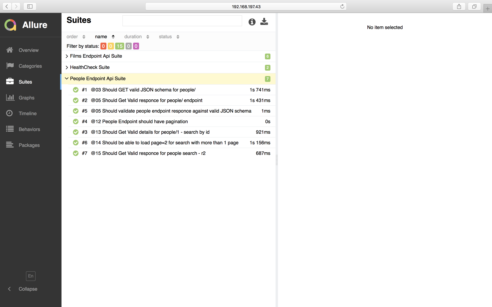
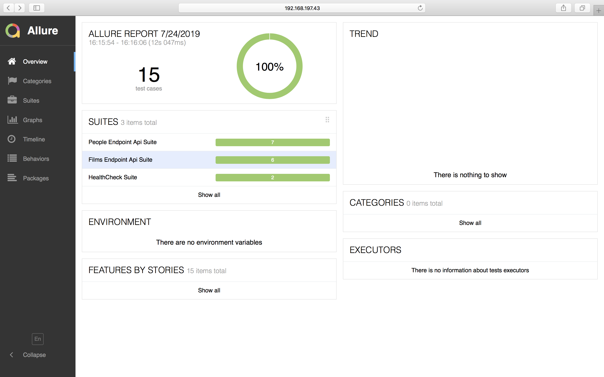

# SWAPI API Tests project

This is a test project for  [Starwars API](https://swapi.co/) API tests that uses request-promise-native and JavaScript.
## Overview
* **Languages:** JavaScript/ Node.JS
* **SCM:** Git
* **Build/Dependency Management:** npm
* **API Testing Frameworks:** Mocha,Request-Promise-Native, Json
* **Assertion Lib:** Chai, Expect, Should
* **CI/CD:** Integration with [CircleCI](https://circleci.com/gh/irfanalinoor) TBD

## Getting Started
```
git clone
cd swapi-api-tests
npm install
npm test
```

## Project Structure
```
.
    ├── framework
       ├── helper
          ├── api_urls.js             # File with valid api urls liet
          ├── log_decorator.js        # File containing function that prints out time of request execution
          ├── mocha.opts
          ├── setup.js                # File containing all setup info for Mocha
       ├── jsonSchema                 # Files for valid JSON schemas

    ├── test                          # Api test file for healthcheck , people and films endpoints
    ├── eslint.json
    ├── .gitinore
    ├── package.json
    └── README.md
```
## Test Cases
The tests in this project use [https://swapi.co/](https://swapi.co/) to demonstrate how to interact with some of the most common API calls for films/ and people/ endpoints.
Test coverage for films/ and people/ endpoints described in [Test cases file](testCases.txt)

## CI - Circle CI
Added simple continuos integration for master branch(need to be adjusted)

[](https://circleci.com/gh/karusya/swapi-api-tests/tree/master)

## Reporters
This projects uses both the [spec-reporter](https://webdriver.io/docs/spec-reporter.html) and [allure-reporter](http://allure.qatools.ru/). The spec reporter offers  feedback when running from terminal and the allure reporter provides you with an html report and screenshots that are automatically attached to failed tests. After running your the tests, run `npm run report` to generate the allure report.
**NOTE:** Allure report is opening empty in Chome - fix it



